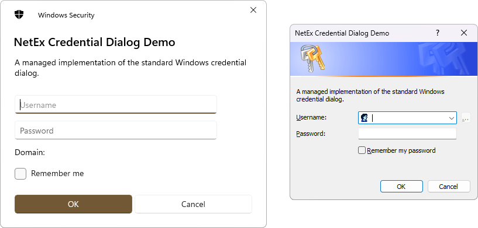
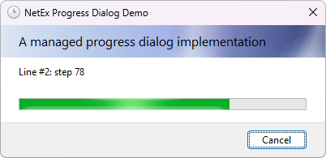

<div align="center">


# NetEx

A collection of .NET controls and libraries that people might (hopefully!) find useful. :relaxed:

</div>

## 📦 Projects

This repo contains the following projects:

### NetEx.Dialogs.WinForms
[](https://www.nuget.org/packages/NetEx.Dialogs.WinForms/) [](https://dotnet.microsoft.com/download) [](https://dotnet.microsoft.com/en-us/download/dotnet-framework)

A managed implementation of the standard Windows credential and progress dialogs, for WinForms.

#### [CredentialDialog](https://peckmore.github.io/NetEx/overview/dialogs.winforms/credentialdialog.html)
Displays a standard dialog box that prompts the user to enter credentials.



#### [ProgressDialog](https://peckmore.github.io/NetEx/overview/dialogs.winforms/progressdialog.html)
Displays a standard dialog box that informs the user of the progress of an action.



### NetEx.Hooks
[](https://www.nuget.org/packages/NetEx.Hooks/) [](https://dotnet.microsoft.com/download) [](https://dotnet.microsoft.com/en-us/download/dotnet-framework)

Provides global hooks for capturing keyboard, mouse, and clipboard events, and simulators for keyboard and mouse events.

#### [ClipboardHook](https://peckmore.github.io/NetEx/overview/hooks/clipboardhook.html)
Provides a mechanism for hooking all clipboard events within the operating system.

#### [KeyboardHook](https://peckmore.github.io/NetEx/overview/hooks/keyboardhook.html)
Provides a mechanism for hooking all keyboard events within the operating system.
#### [KeyboardSimulator](https://peckmore.github.io/NetEx/overview/hooks/keyboardsimulator.html)
A keyboard event simulator, which can simulate `KeyDown`, `KeyUp`, and `KeyPress` events.
#### [MouseHook](https://peckmore.github.io/NetEx/overview/hooks/mousehook.html)
Provides a mechanism for hooking all mouse events within the operating system.

#### [MouseSimulator](https://peckmore.github.io/NetEx/overview/hooks/mousesimulator.html)
A mouse event simulator, which can simulate `MouseClick`, `MouseDoubleClick`, `MouseDown`, `MouseUp`, `MouseMove`, and `MouseWheel` events.

### NetEx.IO
[](https://www.nuget.org/packages/NetEx.IO/) [](https://dotnet.microsoft.com/download) [](https://dotnet.microsoft.com/en-us/download/dotnet-framework) [](https://dotnet.microsoft.com/en-us/platform/dotnet-standard)

Provides additional input and output (I/O) types, that allow reading and/or writing to data streams.

#### [MultiStream](https://peckmore.github.io/NetEx/overview/io/multistream.html)
Creates a wrapper around multiple `Stream` instances, and presents them as a single, read-only stream.
#### [OnDisposeStream](https://peckmore.github.io/NetEx/overview/io/ondisposestream.html)
Creates a wrapper around a `Stream` that can be used to perform additional cleanup when the underlying stream is disposed.

## 🙌 Usage

To use, simply install the required package from NuGet:

```powershell
# NetEx.Dialogs.WinForms
Install-Package NetEx.Dialogs.WinForms

# NetEx.Hooks
Install-Package NetEx.Hooks

# NetEx.IO
Install-Package NetEx.IO
```

## 📖 Documentation

Documentation and example code is available [here](https://peckmore.github.io/NetEx/overview/overview.html).

Full API documentation can be found [here](https://peckmore.github.io/NetEx/api/NetEx.Dialogs.WinForms.html).

## 🚀 Releases

A full list of all releases is available on the [Releases](https://github.com/Peckmore/NetEx/releases) tab on GitHub.

A complete changelog can also be found [here](https://github.com/Peckmore/NetEx/blob/main/CHANGELOG.md).

## 🔢 Versioning

**NetEx** use [Semantic Versioning](https://semver.org) for all packages.

At present, all packages are _built and versioned together_ as this simplifies release management. If a situation is reached whereby some packages are being updated significantly more than others (resulting in a large number of artifical version bumps for some packages) then this will be revisited.

## 📄 License

The code is licensed under the [MIT license](https://github.com/Peckmore/NetEx?tab=readme-ov-file#MIT-1-ov-file).