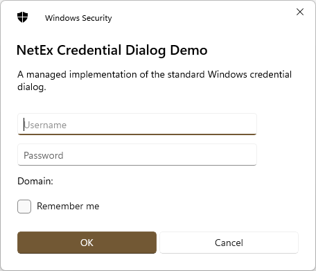
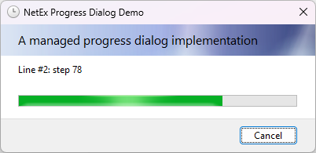

<div align="center">


# NetEx
[](https://github.com/Peckmore/NetEx/releases)
[](https://dotnet.microsoft.com/download)
[](https://dotnet.microsoft.com/en-us/download/dotnet-framework)
[](https://dotnet.microsoft.com/download)

The **NetEx** project contains (hopefully!) useful extensions to the .Net Framework.

</div>

## Overview
This project aims to collect together hopefully useful extensions to .Net into a single repo, and currently consists of the following projects.

### NetEx.WinForms.CredentialDialog
A managed implementation of the standard Windows credential dialog, for WinForms.



### NetEx.WinForms.ProgressDialog
A managed implementation of the standard Windows progress dialog, for WinForms.



## Usage

Install the required package from NuGet:

**Credential Dialog**
```powershell
Install-Package NetEx.WinForms.CredentialDialog
```

**Progress Dialog**
```powershell
Install-Package NetEx.WinForms.CredentialDialog
```

## Documentation
Full documentation is available in the `docs` folder. The documentation is also available online at [https://peckmore.github.io/netex/](https://peckmore.github.io/netex/).

A test project is also included to demonstrates the use of each project.

## Compatibility
Each project targets the lowest framework version or standard possible in order to try and maximise compatibility.

| Project                             | .Net                     | .Net Framework | .Net Standard |
|-------------------------------------|--------------------------|----------------|---------------|
| **NetEx.WinForms.CredentialDialog** | 5.0+<br>*(Windows only)* | 2.0 to 4.8.1   | -             |
| **NetEx.WinForms.ProgressDialog**   | 5.0+<br>*(Windows only)* | 2.0 to 4.8.1   | -             |

## Releases

A full list of all releases is available on the [Releases](https://github.com/Peckmore/netex.winforms.progressdialog/releases) tab on GitHub.

Releases are also available on NuGet:

| Name                                | NuGet |
|-------------------------------------|-------|
| **NetEx.WinForms.CredentialDialog** | [](https://www.nuget.org/packages/NetEx.WinForms.CredentialDialog/) |
| **NetEx.WinForms.ProgressDialog**   | [](https://www.nuget.org/packages/NetEx.WinForms.ProgressDialog/) |

##  License

The code is licensed under the [MIT license](https://github.com/Peckmore/netex.winforms.progressdialog?tab=MIT-1-ov-file#readme).