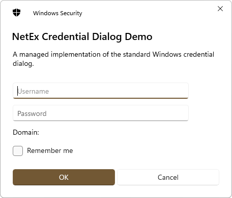
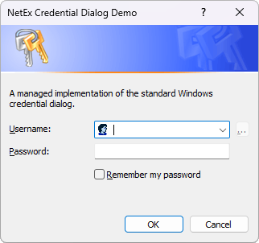

<div align="center">


# NetEx
A collection of (hopefully!) useful "extensions" to .Net.

</div>

## Overview
This project aims to collect together any .Net code, controls, or libraries I've either come across or written that I thought other people might also find useful. :relaxed:

### NetEx.Dialogs.WinForms
[](https://www.nuget.org/packages/NetEx.Dialogs.WinForms/)
[](https://github.com/Peckmore/NetEx/actions/workflows/build.yml)
[](https://dotnet.microsoft.com/download)
[](https://dotnet.microsoft.com/en-us/download/dotnet-framework)

A managed implementation of the standard Windows credential and progress dialogs, for WinForms.

<div align="center">






</div>

### NetEx.Hooks
[](https://www.nuget.org/packages/NetEx.Hooks/)
[](https://github.com/Peckmore/NetEx/actions/workflows/build.yml)
[](https://dotnet.microsoft.com/download)
[](https://dotnet.microsoft.com/en-us/download/dotnet-framework)

Provides global hooks for capturing keyboard, mouse, and clipboard events, and simulators for keyboard and mouse events.

### NetEx.IO
[](https://www.nuget.org/packages/NetEx.IO/)
[](https://github.com/Peckmore/NetEx/actions/workflows/build.yml)
[](https://dotnet.microsoft.com/download)
[](https://dotnet.microsoft.com/en-us/download/dotnet-framework)
[](https://dotnet.microsoft.com/en-us/platform/dotnet-standard)

Provides additional input and output (I/O) types, that allow reading and/or writing to data streams.

## Usage

To use, simply install the required package from NuGet:

```powershell
# NetEx.Dialogs.WinForms
Install-Package NetEx.Dialogs.WinForms

# NetEx.Hooks
Install-Package NetEx.Hooks

# NetEx.IO
Install-Package NetEx.IO
```

## Documentation
Documentation is available [here](https://peckmore.github.io/netex/overview/overview.html).

A test project is also included with the source that demonstrates some of the functionality of the packages.

## Compatibility
Each package targets the lowest framework version or standard possible in order to try and maximise compatibility.

| Project                    | .Net                          | .Net Framework | .Net Standard |
|----------------------------|-------------------------------|----------------|---------------|
| **NetEx.Dialogs.WinForms** | 5.0 - 9.0<br>*(Windows only)* | 2.0 - 4.8.1    | -             |
| **NetEx.Hooks**            | 5.0 - 9.0<br>*(Windows only)* | 2.0 - 4.8.1    | -             |
| **NetEx.IO**               | 5.0 - 9.0                     | 2.0 - 4.8.1    | 2.0 - 2.1     |

## Releases

A full list of all releases is available on the [Releases](https://github.com/Peckmore/netex/releases) tab on GitHub.

##  License

The code is licensed under the [MIT license](https://github.com/Peckmore/NetEx?tab=readme-ov-file#MIT-1-ov-file).