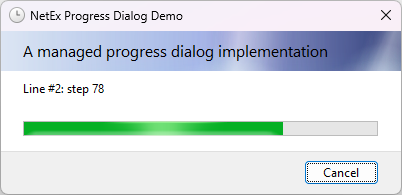

<div align="center">


# NetEx.Winforms.ProgressDialog
A managed implementation of the standard Windows progress dialog.

Part of the *[**NetEx**](https://github.com/Peckmore/netex) Extensions for .Net* project.

[](https://www.nuget.org/packages/NetEx.WinForms.ProgressDialog) [](https://www.nuget.org/packages/NetEx.WinForms.ProgressDialog) [](https://dotnet.microsoft.com/download) [](https://dotnet.microsoft.com/download)

</div>

## Usage

Install the package from NuGet:

```powershell
Install-Package NetEx.WinForms.ProgressDialog
```

## Overview

This project implements a standard Windows progress dialog using the WinForms `CommonDialog` as its base. The project aims to match standard .Net Framework and WinForms behaviour as closely as possible.



`ProgressDialog` supports the standard `ShowDialog()` method of invocation, as is standard across all dialogs using `CommonDialog`. However, because the dialog is typically expected to be shown in a non-modal fashion, it is recommended to use the `Show()` method instead.

`ProgressDialog` is supported on all versions of Windows starting with *Windows XP*.

*Windows Vista* introduced new visual styling for many controls and UI elements, including the Windows progress dialog. As a result, the appearance of the dialog is different between *Windows XP* and later Windows versions.

*Windows 7* introduced the ability to display progress indicators on a taskbar icon. The Windows progress dialog, and subsequently this `ProgressDialog` implementation, will therefore automatically display progress notification in the host application's taskbar icon on *Windows 7* or later.

## Compatibility

This project is compatible with:

| Framework                 | Versions     |
|---------------------------|--------------|
| **.Net Framework**        | 2.0 to 4.8.1 |
| **.Net** *(Windows only)* | 5.0+         |

## Projects

The source for this repository contains two projects:

| Project                               | Description |
|---------------------------------------|-------------|
| **NetEx.WinForms.ProgressDialog**     | The source for the managed implementation of the standard Windows progress dialog. |
| **NetEx.WinForms.ProgressDialogDemo** | A test project which demonstrates the use of the progress dialog.         |

## Releases

A full list of all releases is available on the [Releases](https://github.com/Peckmore/netex.winforms.progressdialog/releases) tab on GitHub.

Releases of are also available on NuGet:

| Name                                                  | NuGet |
|-------------------------------------------------------|-------|
| **NetEx.WinForms.ProgressDialog**                     | [](https://www.nuget.org/packages/NetEx.WinForms.ProgressDialog/)|
| _Previously published as_<br>**NetEx-ProgressDialog** | [](https://www.nuget.org/packages/NetEx-ProgressDialog/)|

##  License

The code is licensed under the [MIT license](https://github.com/Peckmore/netex.winforms.progressdialog?tab=MIT-1-ov-file#readme).
