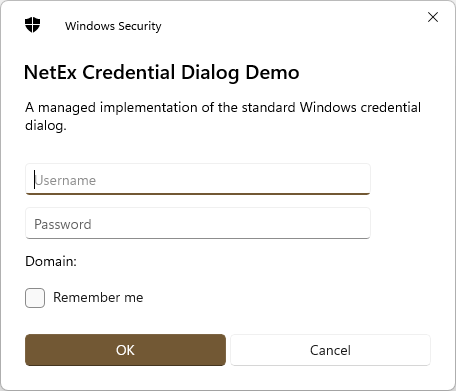
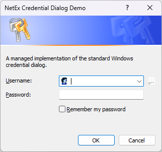

# NetEx.CredentialDialog
A managed implementation of the standard Windows credential dialog.

Part of the *[**NetEx**](https://github.com/Peckmore/netex) Extensions for .Net* project.

 

## Overview

This project implements a standard Windows credential dialog using the WinForms `CommonDialog` as its base.

The project aims to match standard .Net Framework and WinForms behaviour as closely as possible.

 

This project is compatible with:
- **.Net Framework**: 2.0 to 4.8.1
- **.Net**: 5.0+ *(Windows only)*

## Source

The source for this repository contains two projects:

- **NetEx.CredentialDialog**
  The source for the managed implementation of the standard Windows credential dialog.

- **NetEx.CredentialDialogDemo**
  A test project which demonstrates use of the credential dialog.

##  License

The code is licensed under the [MIT license](https://github.com/Peckmore/NetEx.CredentialDialog?tab=MIT-1-ov-file#readme).