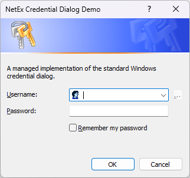

# Credential Dialog

A managed implementation of the standard Windows credential dialog, for WinForms.

## Usage

Install the package from NuGet:

```powershell
Install-Package NetEx.WinForms.CredentialDialog
```

## API

API documentation is available [here](xref:System.Windows.Forms.CredentialDialog).

## Overview

This project implements a standard Windows credential dialog using the WinForms `CommonDialog` as its base. The project aims to match standard .Net Framework and WinForms behaviour as closely as possible.




`CredentialDialog` supports the standard `ShowDialog()` method of invocation, as is standard across all dialogs using `CommonDialog`.

`CredentialDialog` is supported on all versions of Windows starting with *Windows XP*.

*Windows Vista* introduced new visual styling for many controls and UI elements, but for the credential dialog this was done as a seperate implementation. As a result, on *Windows Vista* and later, the appearance of the dialog can be selected using [AutoUpgradeEnabled](xref:System.Windows.Forms.CredentialDialog.AutoUpgradeEnabled).

## Compatibility

| Product                   | Versions              |
|---------------------------|-----------------------|
| **.Net**                  | 5.0+ *(Windows only)* |
| **.Net Framework**        | 2.0 to 4.8.1          |