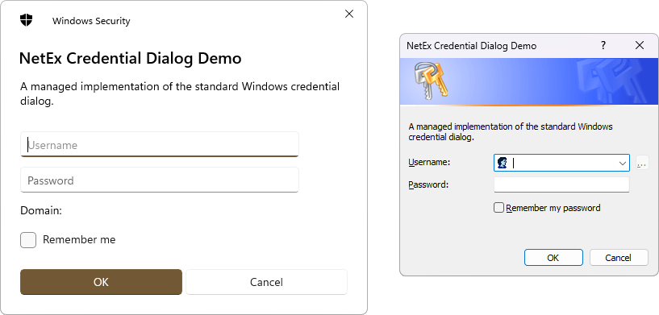

# CredentialDialog

The [CredentialDialog](xref:NetEx.Dialogs.WinForms.CredentialDialog) component is a pre-configured dialog box. It is the same **Credential** dialog box exposed by the Windows operating system. It inherits from the [CommonDialog](xref:System.Windows.Forms.CommonDialog) class.

The project aims to match standard .Net Framework and WinForms behaviour as closely as possible.

<div align="center">



</div>

## Use this component

If you have not already added it to your project, install the package from NuGet:

```powershell
Install-Package NetEx.Dialogs.WinForms
```

Use this component within your Windows-based application as a simple solution for credential entry in lieu of configuring your own dialog box. By relying on standard Windows dialog boxes, you create applications whose basic functionality is immediately familiar to users. Be aware, however, that when using the [CredentialDialog](xref:NetEx.Dialogs.WinForms.CredentialDialog) component, you must write your own credential handling logic.

Use the [ShowDialog](xref:System.Windows.Forms.CommonDialog.ShowDialog) method to display the dialog at run time.

When it is added to a form, the [CredentialDialog](xref:NetEx.Dialogs.WinForms.CredentialDialog) component appears in the tray at the bottom of the Windows Forms Designer in Visual Studio.

## Example

The following example uses the Windows Forms [Button](xref:System.Windows.Forms.Button) control's [Click](xref:System.Windows.Forms.Control.Click) event handler to open the [CredentialDialog](xref:NetEx.Dialogs.WinForms.CredentialDialog) with the [ShowDialog](xref:System.Windows.Forms.CommonDialog.ShowDialog) method. After the user enters their details, the username is shown in a [MessageBox](xref:System.Windows.Forms.MessageBox).

```csharp
using NetEx.Dialogs.WinForms;
using System;
using System.Windows.Forms;

public class CredentialDialogForm : Form
{
    [STAThread]
    public static void Main()
    {
        Application.SetCompatibleTextRenderingDefault(false);
        Application.EnableVisualStyles();
        Application.Run(new CredentialDialogForm());
    }

    private Button selectButton;
    private CredentialDialog credentialDialog1;

    public CredentialDialogForm()
    {
        credentialDialog1 = new CredentialDialog();
        selectButton = new Button
        {
            Size = new Size(100, 20),
            Location = new Point(15, 15),
            Text = "Enter credentials"
        };
        selectButton.Click += new EventHandler(SelectButton_Click);
        ClientSize = new Size(330, 360);
        Controls.Add(selectButton);
    }
    private void SelectButton_Click(object sender, EventArgs e)
    {
        if (credentialDialog1.ShowDialog() == DialogResult.OK)
        {
            MessageBox.Show("Domain:\n"
                            + credentialDialog1.Domain
                            + "\n\nUser:\n"
                            + credentialDialog1.Username
                            + "\n\nPassword is a SecureString and cannot be displayed without converting to a String.");
        }
    }
}
```

## Applies to

Product             | Versions
--------------------|---------
**.Net Framework**  | 2.0, 3.0, 3.5, 4.0, 4.5, 4.5.1, 4.5.2, 4.6, 4.6.1, 4.6.2, 4.7, 4.7.1, 4.7.2, 4.8, 4.8.1
**Windows Desktop** | 5, 6, 7, 8, 9