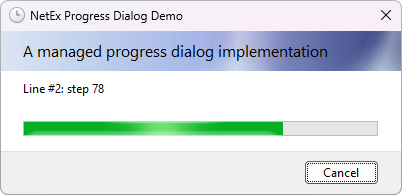

# ProgressDialog

The [ProgressDialog](xref:NetEx.Dialogs.WinForms.ProgressDialog) component is a pre-configured dialog box. It is the same **Progress** dialog box exposed by the Windows operating system. It inherits from the [CommonDialog](xref:System.Windows.Forms.CommonDialog) class.

The project aims to match standard .NET Framework and WinForms behaviour as closely as possible.

<div align="center">



</div>

## Use this component

If you have not already added it to your project, install the package from NuGet:

```powershell
Install-Package NetEx.Dialogs.WinForms
```

Use this component within your Windows-based application as a simple solution for displaying progress in lieu of configuring your own dialog box. By relying on standard Windows dialog boxes, you create applications whose basic functionality is immediately familiar to users. Be aware, however, that when using the [ProgressDialog](xref:NetEx.Dialogs.WinForms.ProgressDialog) component, you must write your own progress updating logic.

Use the [ShowDialog](xref:System.Windows.Forms.CommonDialog.ShowDialog) method to display the dialog at run time in a modal fashion. Use the [Show](xref:NetEx.Dialogs.WinForms.ProgressDialog.Show) method to display the dialog at run time in a non-modal fashion.

When it is added to a form, the [ProgressDialog](xref:NetEx.Dialogs.WinForms.ProgressDialog) component appears in the tray at the bottom of the Windows Forms Designer in Visual Studio.

## Example

The following example uses the Windows Forms [Button](xref:System.Windows.Forms.Button) control's [Click](xref:System.Windows.Forms.Control.Click) event handler to start a background task and then open the [ProgressDialog](xref:NetEx.Dialogs.WinForms.ProgressDialog) with the [ShowDialog](xref:System.Windows.Forms.CommonDialog.ShowDialog) method. The dialog will display the progress of the background task as it runs.

```csharp
using NetEx.Dialogs.WinForms;
using System;
using System.Windows.Forms;

public class ProgressDialogForm : Form
{
    [STAThread]
    public static void Main()
    {
        Application.SetCompatibleTextRenderingDefault(false);
        Application.EnableVisualStyles();
        Application.Run(new ProgressDialogForm());
    }

    private Button selectButton;
    private ProgressDialog progressDialog1;

    public ProgressDialogForm()
    {
        progressDialog1 = new ProgressDialog
        {
            Maximum = 100
        };
        selectButton = new Button
        {
            Size = new Size(100, 20),
            Location = new Point(15, 15),
            Text = "Run task"
        };
        selectButton.Click += new EventHandler(SelectButton_Click);
        ClientSize = new Size(330, 360);
        Controls.Add(selectButton);
    }
    private void SelectButton_Click(object sender, EventArgs e)
    {
        Task.Run(() =>
        {
            progressDialog1.SetLine(1, "Doing background work...");

            while (progressDialog1.Value < progressDialog1.Maximum)
            {
                progressDialog1.Value += 1;
                progressDialog1.SetLine(2, $"Current value: {progressDialog1.Value}");
                progressDialog1.Title = $"Worker task ({progressDialog1.Value}%)";
                Thread.Sleep(100);
            }
        }).ContinueWith(t =>
        {
            // Close the progress dialog after the task is complete
            progressDialog1.Close();
        }, TaskScheduler.FromCurrentSynchronizationContext());

        progressDialog1.ShowDialog();
    }
}
```

## Applies to

Product             | Versions
--------------------|---------
**.NET Framework**  | 2.0, 3.0, 3.5, 4.0, 4.5, 4.5.1, 4.5.2, 4.6, 4.6.1, 4.6.2, 4.7, 4.7.1, 4.7.2, 4.8, 4.8.1
**Windows Desktop** | 5, 6, 7, 8, 9